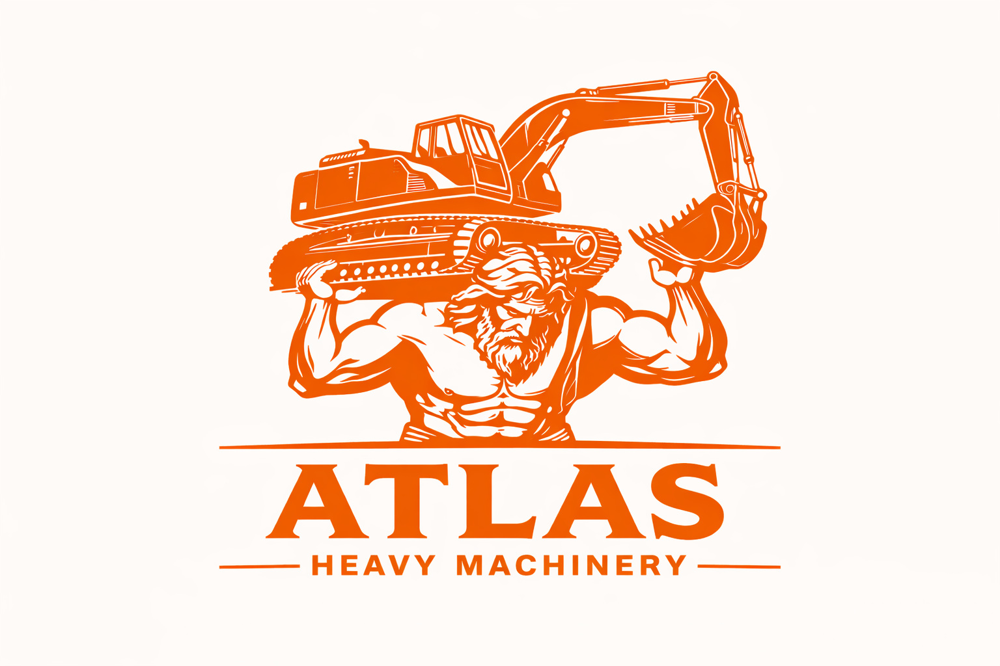

  

# Atlas Heavy Machinery – AMC Revenue & Churn Analytics

An end-to-end analytics project using Python, MySQL, and Power BI to analyze AMC (Annual Maintenance Contract) performance, identify churn drivers, and improve recurring revenue visibility.

---

## Overview

This project delivers a complete analytical solution for **Atlas Heavy Machinery (AHM)**, focusing on **AMC attachment, renewal behavior, and churn analysis**.

The objective is to help business stakeholders understand:
- What drives AMC revenue
- Where revenue leakage (churn) occurs
- How dealer performance, fleet size, and machine category impact AMC outcomes

The analysis integrates:
- **Python (EDA & statistical analysis)**
- **MySQL (analytical queries)**
- **Power BI (interactive dashboards)**

---

## Business Context

Atlas Heavy Machinery sells construction equipment through **150+ dealers across West and Central India**.

- AMC is the **only predictable recurring revenue stream**
- Leadership identified concerns:
  - Declining AMC attachment and renewal rates
  - Lack of clarity on churn drivers
  - Uncertainty if higher sales translate into higher AMC revenue

This project addresses these gaps through structured analysis and visualization.

---

## Data & Assumptions

- Dataset is **synthetic and created for portfolio purposes**
- Covers **machine sales, customers, dealers, and AMC contracts**
- Includes:
  - Machine categories and pricing
  - Dealer and regional performance
  - Customer segmentation (fleet size)
  - AMC lifecycle (attached, renewed, churned)

- AMC status is classified as:
  - Active
  - Renewed
  - Churned

---

## Key Analytical Components

### Python (EDA & Statistical Analysis)

- Data validation (null checks, consistency, relationships)
- Fleet size segmentation (Small → Very Large)
- AMC attachment & churn rate calculation
- Chi-Square Test → Fleet size vs churn dependency
- Linear Regression → Machine sales vs AMC revenue
- Identification of high-risk segments

---

### MySQL (Analytical Queries)

- Dealer-wise sales vs AMC revenue analysis
- Category-wise attachment and churn trends
- State-wise and regional performance
- AMC conversion and renewal tracking
- Revenue at risk calculation
- Aggregations using joins, CTEs, and window functions

---

### Tableau Desktop (Dashboards)

#### Sales Performance Dashboard
- Total Revenue: ₹1,411.82 Cr
- Units Sold: 4,000
- Dealer Contribution Analysis
- State-wise Revenue Distribution
- Category-wise Sales Mix
- Quarterly Sales Trend

#### AMC & Churn Dashboard
- AMC Attachment Rate: 62.90%
- Renewal Rate: 79.08%
- Churn Rate: 20.92%
- Revenue at Risk by Category
- Fleet Size vs Churn Analysis
- Dealer-wise Conversion Performance
- Category-level AMC performance

---

## High-Level Insights

- AMC revenue is **partially dependent on machine sales (55%)**, but heavily influenced by **dealer conversion and customer behavior**
- **Small fleet customers have the highest churn (32.67%)**, making them the primary risk segment
- **Backhoe Loader (high volume) has low AMC attachment**, creating major revenue leakage
- **Excavator contributes highest AMC revenue but also highest risk**, requiring focused attention
- Dealer performance varies significantly, with some showing **low conversion rates (~30%)**

---

## Business Recommendations

- Improve AMC attachment at **point of sale**, especially for high-volume categories
- Target **small fleet customers** with retention strategies
- Introduce **dealer-level AMC conversion benchmarks**
- Focus on **high revenue + high risk categories (Excavator, Backhoe Loader)**
- Strengthen **post-sale AMC engagement and renewal programs**

---

## Tools Used

- **Python**: pandas, numpy, matplotlib, scipy, statsmodels
- **SQL**: MySQL (joins, CTEs, window functions)
- **Visualization**: Power BI

---

## How to View

1. Open `AHM_EDA.ipynb` → Data cleaning, EDA, statistical analysis  
2. Run `AHM_SQL_queries.sql` → Schema and analytical queries  
3. View Tableau Desktop dashboard / report screenshots for business insights  

---

## Disclaimer

This project is created for **learning and portfolio purposes only**.

- Data is **synthetic**
- Company name, structure, and scenarios are **fictional**
- Any resemblance to real entities is purely coincidental

---
